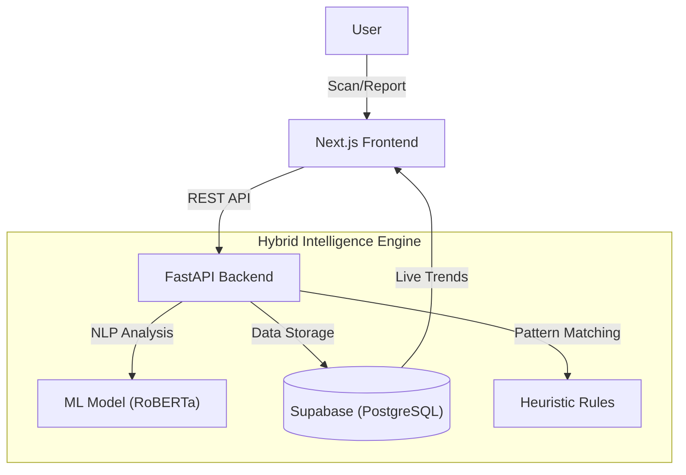

# ScamShield 🛡️

**ScamShield** is a next-generation **Hybrid Intelligence Platform** designed to detect, analyze, and prevent digital scams in real-time. By combining state-of-the-art **Machine Learning (RoBERTa)** with **Community-Driven Signals**, ScamShield provides a robust defense against UPI fraud, phishing links, fake messages, and malicious phone numbers.

---

## 🔄 User Flow: How It Works

ScamShield operates on a simple "Scan, Analyze, Protect" loop:

### 1. **The Input (Scan)**
*   **User Action**: A user receives a suspicious text, a weird UPI ID, or a link they aren't sure about.
*   **Interaction**: They paste this identifier into the **ScamShield Live Scanner** on the home page.
*   **System Check**: The frontend instantly sends this query to the backend API.

### 2. **The Analysis (The Brain)**
The backend `FastAPI` engine processes the input through three simultaneous layers:
*   **Layer 1: Community Database Check**:
    *   *Action*: Queries Supabase to see if anyone else has reported this specific number/ID.
    *   *Result*: Instant "Flagged" status if matches are found.
*   **Layer 2: AI Semantic Analysis (RoBERTa)**:
    *   *Action*: If the input is text (e.g., "Urgent! Your KYC is expired"), the Transformer model analyzes the **intent** and **urgency**.
    *   *Result*: Generates a "Suspicion Score" based on linguistic patterns used by scammers.
*   **Layer 3: Rule-Based Heuristics**:
    *   *Action*: Checks for known danger patterns (e.g., international codes like `+92`, `+234` or "click here" links).
    *   *Result*: Overrides other signals if a known critical threat pattern is detected.

### 3. **The Result (The Shield)**
*   **Risk Meter**: The user sees a visual gauge from **0-100% Risk**.
*   **Explainability**: The system tells them *why*:
    *   *"Flagged by 12 community members"*
    *   *"AI detected high urgency language"*
    *   *"Contains high-risk country code"*
*   **Actionable Advice**: The user gets clear steps: *"Block this number immediately"* or *"Do not click the link"*.

### 4. **The Contribution (The Loop)**
*   **Reporting**: If a user encounters a new scam, they visit the **/report** page.
*   **Submission**: They provide the scammer's details, evidence, and description.
*   **Real-Time Data**: This report issues a **Live Alert** on the homepage ticker and immediately updates the database, protecting current and future users.

---

## 🏗️ Technical Architecture

### **Frontend**
*   **Framework**: Next.js 14 (App Router)
*   **Styling**: Tailwind CSS v4 + Framer Motion (Glassmorphism & Neon Aesthetics)
*   **Visualization**: Recharts for data trends.

### **Backend**
*   **Language**: Python 3.11+
*   **Framework**: FastAPI
*   **ML Engine**: Hugging Face Transformers (`mshenoda/roberta-spam`)
*   **Database**: Supabase (PostgreSQL)

---

## 🚀 Deployment

The project is designed for a split deployment architecture:

### **Frontend (Vercel)**
*   Hosted on **Vercel** for optimal Next.js performance.
*   Connects to the backend via `NEXT_PUBLIC_API_URL`.

### **Backend (Render)**
*   Hosted on **Render** as a Web Service.
*   Runs `uvicorn` with `gunicorn` support.
*   **Config**: `render.yaml` included for auto-deployment.
*   **Env Vars**: Requires `SUPABASE_URL` and `SUPABASE_KEY`.

---

## 📊 Features & Status

*   **Scanning Engine**: ✅ Fully Operational. Detects Text, UPI, and URLs.
*   **Risk Scoring**: ✅ Live. Calculates 0-100 risk based on hybrid signals.
*   **Live Ticker**: ✅ Live. Real-time feed of scams reported by the community.
*   **Trends Dashboard**: ✅ Live. Analytics on high-risk categories and activity spikes.
*   **Traceability**: ✅ Live. Click-through from charts to actual evidence reports.
*   **Dark Mode**: ✅ Standard. Optimized for high contrast and modern feel.

## 🤝 Contributing
Users are encouraged to add new scam reports daily. This crowdsourced data is the backbone of ScamShield's detection capability.
1.  **Via App**: Use the "Report a Scam" button.
2.  **Via API**: POST to `/api/v1/reports`.

---
*Built with ❤️ by Priyanshu & Team for a Safer Digital India.*
