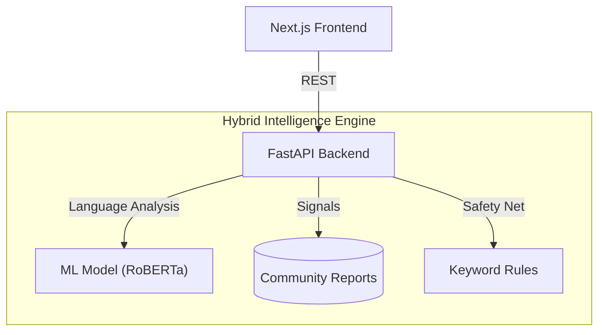

# ScamShield 🛡️

**ScamShield** is a fully functional, **Hybrid intelligence platform combining machine‑learning–based language analysis with community‑driven signals** designed to detect, report, and prevent digital scams in real-time.

## 🏗️ Technical Architecture

### **Frontend (The Face)**
*   **Framework**: Next.js 14 (App Router)
*   **UI Library**: Tailwind CSS v4 + Framer Motion (Glassmorphism & Neon Aesthetics).
*   **Key Components**:
    *   **Live Sanner**: Instant risk assessment interface.
    *   **Risk Meter**: Animated gauge visualizing threat levels (Safe, Caution, Critical).
    *   **Live Ticker**: Real-time scrolling feed of recent community reports (`LiveTicker.tsx`).
    *   **Reporting Portal**: Dedicated page (`/report`) for users to submit evidence.

### **Backend (The Brain)**
*   **Framework**: FastAPI (Python).
*   **Database**: Supabase (PostgreSQL) - Stores `reports` and fraud entities.
*   **AI Engine**:
    *   **Model**: `mshenoda/roberta-spam` (Robust Transformer model for scam text classification).
    *   **Logic**: `ml_engine.py` handles model inference utilizing a Singleton pattern for performance.
*   **API**:
    *   `GET /scan`: Hybrid risk assessment logic.
    *   `POST /reports`: Validates and saves new scam reports.
    *   `GET /reports/recent`: Powers the live feed.

## 🧠 The Hybrid Risk Logic (Key Differentiator)

ScamShield calculates a **Risk Score (0-100)** using a multi-layered approach:

1.  **AI Detection (RoBERTa)**: Analyzes semantic intent. (e.g., "Urgent action required").
2.  **Keyword Safety Net**: Hard-coded overrides for high-danger patterns.
    *   *Example*: If a message contains "package delivery" + "click here", it forces a **CRITICAL SCORE (75)** even if the AI is unsure.
3.  **Community Consensus**: Checks Supabase for existing reports against the identifier.

## 🚀 Current Status: [BETA READY]

*   **Scanning**: ✅ Fully Operational. Detects Text, UPI, and URLs.
*   **Reporting**: ✅ Fully Operational. Users can submit detailed reports.
*   **Live Feed**: ✅ Fully Operational. Home page displays real-time scam alerts.
*   **Detailed Reports**: ✅ Fully Operational. Users can read actual report descriptions in scan results.
*   **Trends Dashboard**: ✅ Fully Operational. Visual charts for scam activity and categories.
*   **Traceable Data**: ✅ Fully Operational. Click on charts to see the exact reports behind the data.
*   **Database**: ✅ Connected & Seeded with test data.
